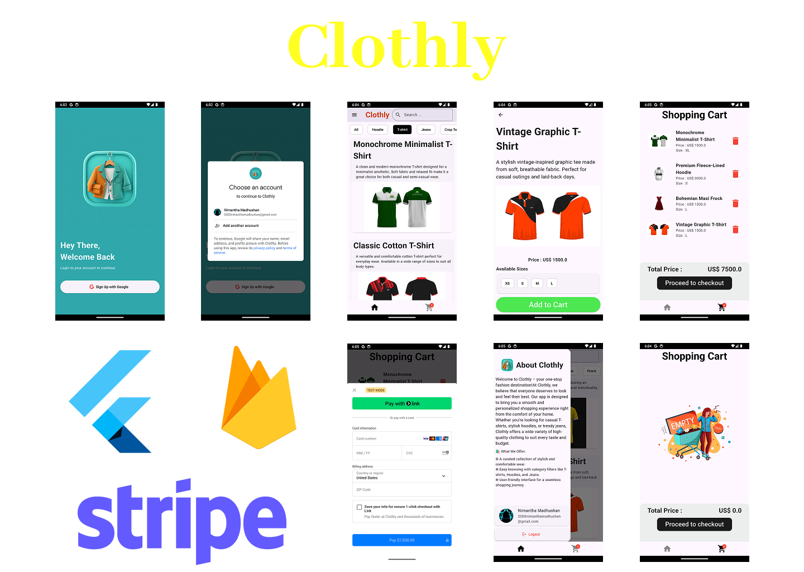
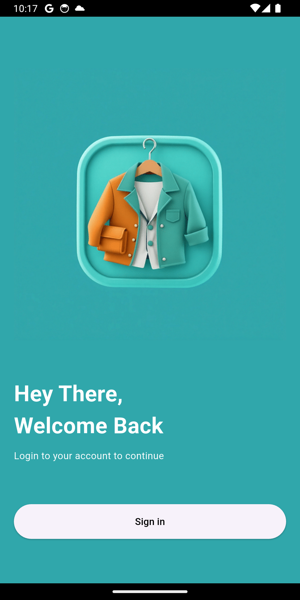
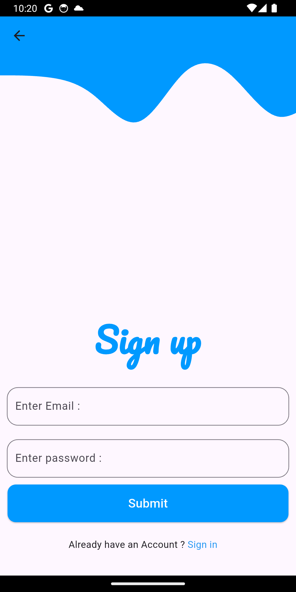
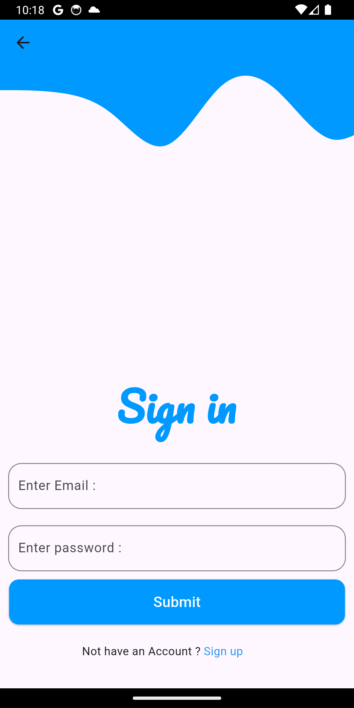
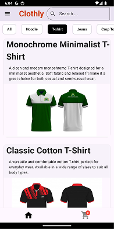
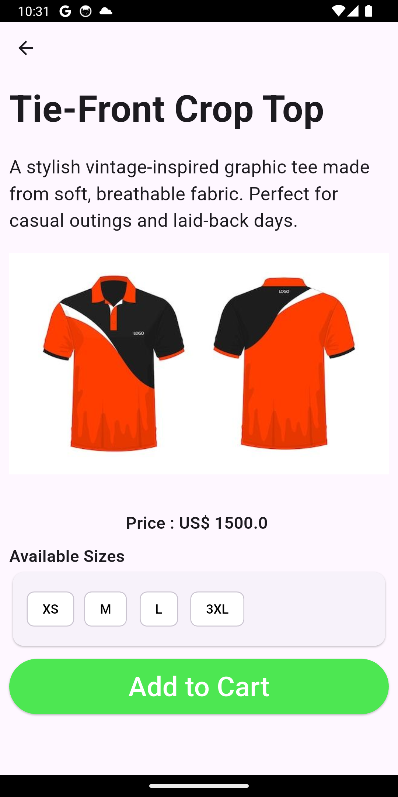
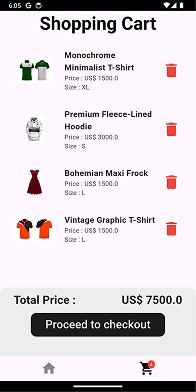
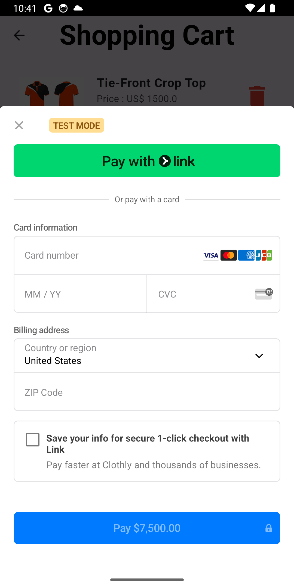
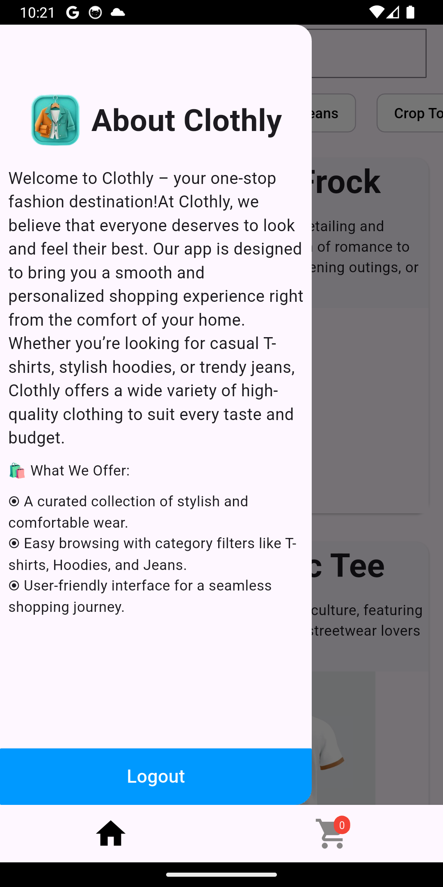

# 👕 Clothly – Fashion Shopping App

Clothly is a modern, responsive cross-platform e-commerce app built with Flutter. It offers users a seamless clothing shopping experience with custom Node.js + Express backend authentication, a REST API for product data, integrated Stripe payments, and a smooth, user-friendly UI/UX design.



---

## ✨ Features

- 🔐 Google Sign-In with Backend Authentication (Node.js + Express)
- 📦 Product categories (T-Shirts, Hoodies, Frocks, etc.)
- 📏 Size selection and quantity adjustment
- 🛒 Real-time shopping cart management
- 💳 Secure Stripe checkout with `flutter_stripe`
- 🗂️ MongoDB integration for product and cart data via Express API
- 💡 State management with `Provider`
- 🎨 Beautiful, intuitive UI and smooth navigation
- 🧪 Unit & integration tested for high reliability

---

## 📸 Screenshots

| Login Screen                           | Sign Up Screen                           | Sign In Screen                           | Product List                         | Product Details                          | Shopping Cart                        | Stripe Checkout                          | About Page                             |
| -------------------------------------- | ---------------------------------------- | ---------------------------------------- | ------------------------------------ | ---------------------------------------- | ------------------------------------ | ---------------------------------------- | -------------------------------------- |
|  |  |  |  |  |  |  |  |

> ⚠️ Make sure you create the `/assets/screenshots/` folder and place the respective images there, or update the paths accordingly.

---

## 🧰 Tech Stack

- **Flutter** – UI toolkit for building responsive cross-platform apps
- **Node.js + Express** – Backend server and RESTful API
- **MongoDB** – Database for storing products, users, and cart data
- **Stripe** – Secure payment processing
- **Provider** – State management for Flutter
- **flutter_dotenv** – Environment variable and secret management

---

## 🚀 Getting Started

### ✅ Prerequisites

- [Flutter SDK](https://docs.flutter.dev/get-started/install)
- Node.js + Express backend server running locally or hosted
- MongoDB database (local or cloud via MongoDB Atlas)
- Stripe developer account with publishable and secret keys

### 🔧 Setup Instructions

1. **Clone the Repository**
   ```bash
   git clone https://github.com/01Nimantha/clothly.git
   cd clothly
   ```

### ⚙️ Backend Setup

1. Navigate to the backend folder:
   ```bash
   cd backend
   ```
